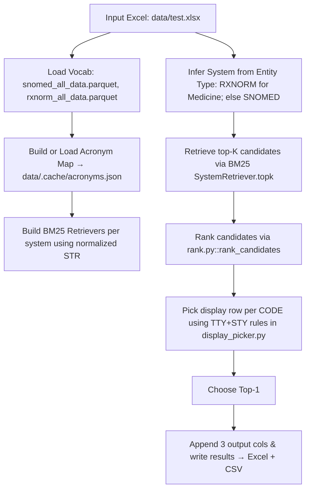
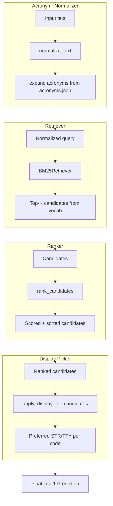

# 🏥 HiLabs Mapper – Medical Entity Normalization

This project implements an **end-to-end pipeline** to normalize free-text medical entities (like medications, diagnoses, procedures, labs) into **standard terminologies** such as **SNOMED CT** and **RxNorm**.

It uses:
- **BM25 retrieval** (via LangChain Community retriever)  
- **Dynamic acronym + synonym expansion** (e.g., `mri` → `magnetic resonance imaging`)  
- **Ranker** (semantic + heuristic signals, contrast handling, prefix bonuses)  
- **STY-based filtering** (ensures only entity-type–appropriate matches are chosen)  
- **Display picker** (chooses best human-readable STR/TTY per code)  

---

## 📂 Project Structure

```
hilabs-mapper/
│
├── data/                       # Data files
│   ├── snomed_all_data.parquet
│   ├── rxnorm_all_data.parquet
│   ├── test.xlsx               # Input Excel
│   └── .cache/                 # Cached acronym maps
│
├── src/hilabs_mapper/          # Core source code
│   ├── acronyms.py             # Builds acronym expansion map
│   ├── display_picker.py       # Chooses best display STR
│   ├── loader.py               # Loads parquet vocabs
│   ├── normalize.py            # Normalizer + acronym expansion
│   ├── rank.py                 # Ranking logic
│   ├── retrieve.py             # BM25 retrievers
│   ├── router.py               # Entity type → System routing
│   └── __init__.py
│
├── test_code/                  # Test scripts for components
│   ├── test_loader.py
│   ├── test_rank.py
│   ├── test_retriever.py
│   └── test_router.py
│
├── end_to_end_pipeline.py      # Main orchestrator script
├── requirements.txt            # Dependencies
├── test.csv                    # Auto-written CSV snapshot
└── README.md
```

---

## ⚙️ Installation

Create a fresh Python environment and install dependencies:

```bash
pip install -r requirements.txt
```

---

## 🚀 How to Run the Pipeline

You can run the pipeline in two ways:

### 1. Quick Run (uses defaults)
```bash
python end_to_end_pipeline.py
```

This will:
- Read input from `data/test.xlsx`
- Write predictions back into the same Excel file
- Also write a CSV snapshot to `test.csv` in the project root

### 2. Custom Run (with options)
```bash
python end_to_end_pipeline.py --input data/test.xlsx --outcsv test.csv --k 20
```

- `--input`: Path to input Excel file (default: `data/test.xlsx`)
- `--sheet`: Optional sheet name in the Excel file
- `--outcsv`: Output CSV in project root (default: `test.csv`)
- `--k`: BM25 top-k candidates per query (default: 25)

---

## 🧠 How It Works

The pipeline follows these steps:

1. Load vocabularies from `snomed_all_data.parquet` and `rxnorm_all_data.parquet`.

2. Build or load acronym map (cached in `data/.cache/acronyms.json`).

3. Build BM25 retrievers (one per system, SNOMED + RxNorm).

4. Read input Excel file (with columns: `Input Entity Description`, `Entity Type`).

5. Infer target system:
   - Medicine → RxNorm
   - All else (Procedure, Diagnosis, Lab) → SNOMED CT

6. Retrieve top-K candidates using BM25.

7. Rank candidates with semantic + heuristic scoring:
   - Token overlap, prefix bonus
   - Site-specific handling (e.g., "pelvis" vs. generic MRI)
   - Contrast handling
   - TTY/STY preferences

8. Pick best display row per code using `display_picker.py`:
   - RxNorm → prefers Clinical Drugs, Ingredients, etc.
   - SNOMED → filters by allowed STY for the entity type

9. Select top-1 result for each query.

10. Write results:
    - Append 3 output columns to the input Excel (`Output Coding System`, `Output Target Code`, `Output Target Description`).
    - Emit a CSV (`test.csv`) with the same format.

---

## 📊 Flow Architectures

### 🔹 End-to-End Pipeline



### 🔹 Component-Level View



---

## ✅ Example Run

```bash
python end_to_end_pipeline.py
```

Sample terminal output:

```
Loading vocabularies (SNOMEDCT_US, RXNORM)…
Loaded acronym cache → data/.cache/acronyms.json
Building BM25 retrievers… please wait 30-60 seconds
Retrievers ready.
Running end-to-end mappings…

----------------------------------------
Input: mri pelvis  |  Type: Procedure  |  System: SNOMEDCT_US
Top candidates:
 TTY      CODE                                   STR  final_score
  PT 433138001        MRI of pelvis with contrast     0.250000
  PT 113091000         Magnetic resonance imaging     0.200000
  PT   2690005                      MRI of pelvis     0.166667

----------------------------------------
Input: aspirin 81 mg tablet  |  Type: Medicine  |  System: RXNORM
Top candidates:
 TTY   CODE                                    STR  final_score
SCDC 315431                          aspirin 81 MG     0.800000
 SBD 211893 aspirin 81 MG Oral Tablet [Acuprin 81]     0.666667
SBDC 572222             aspirin 81 MG [Acuprin 81]     0.600000

Done. Mapping time: 120.5s  |  Total time: 180.2s
Writing predictions back to Excel → data/test.xlsx
Wrote CSV snapshot → test.csv
```

## Code Demonstration Video Link:
https://drive.google.com/file/d/1GtzjYpZzn9dO66FZ-fEwAFpOSYO6r_Kp/view?usp=sharing
